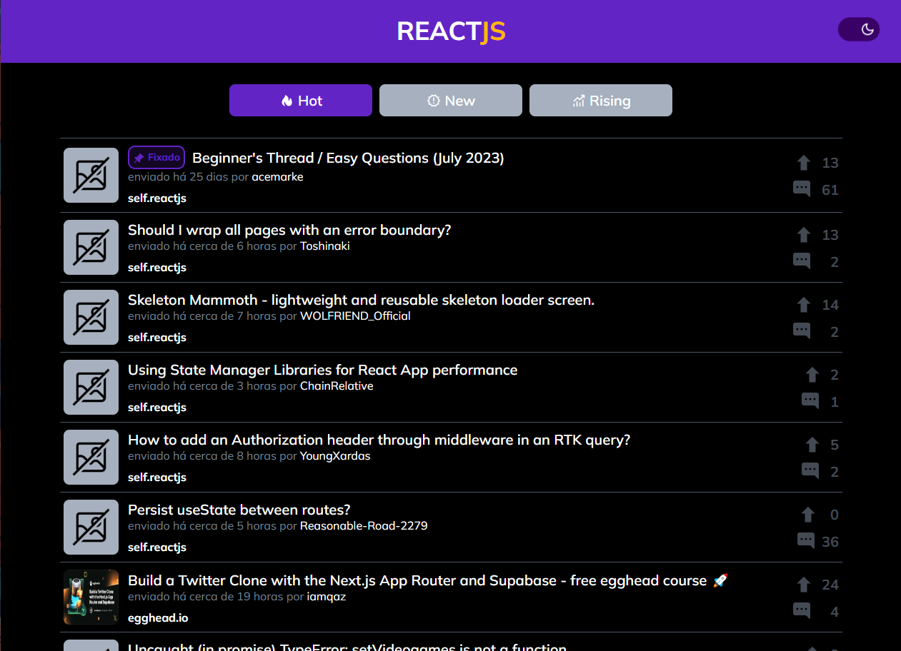

# SubReddit do ReactJS

Este projeto foi desenvolvido como parte do processo seletivo para a vaga de desenvolvedor front-end da empresa Winnin, que tem como objetivo
criar um site em ReactJS que exiba posts do [SubReddit do ReactJS](https://www.reddit.com/r/reactjs/), utilizando a API do Reddit. Nele é possível:
- Acessar o SubReddit através da logo do projeto, na barra superior;
- Trocar entre tema claro e escuro pelo switch na barra superior;
- Trocar entre posts em destaque (Hot), novos (New) e em ascenção (Rising);
- Ver a lista de posts de cada categoria, exibindo título, momento da criação, thumbnail do post e autor, alem do número de comentários e "curtidas" do post;
- Acessar o post no Reddit clicando no item da lista e poder ver o perfil do autor, clicando no nome;
- Carregar mais posts (+10 por clique) através do botão no final da lista.

### [Acesse o site do projeto clicando aqui!](https://reactjs-subreddit.netlify.app/)

### Imagens do sistema

### Como executar o projeto

- Clone ou baixe o projeto no seu computador;
- Tenha instalado a última versão do [Node.js LTS](https://nodejs.org/) e o [yarn](https://yarnpkg.com/) (opcional);
- Com o terminal aberto na raiz do projeto, execute o comando `yarn` ou `npm install` para instalar as dependências do projeto;
- Finalizada a instalação das dependências, execute o comando `yarn start` ou `npm start` para executar o projeto;
- Será aberta uma nova aba com o projeto sendo executado.